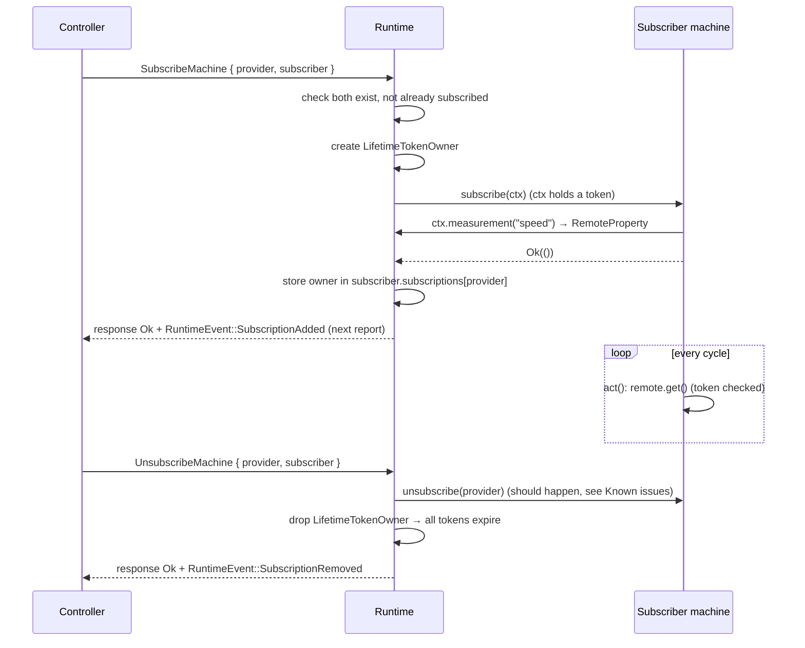

# Subscriptions

A **subscription** lets one machine read another machine's [value resources](../resources.md#value-resources-and-signal-resources) directly inside the Runtime, cycle by cycle, without going through the controller.

Typical uses: a winder that follows an extruder's line speed, a cutter that needs a laser's measured diameter, or a production line whose stations coordinate.

Code: `qitech_framework/src/machine/subscribe.rs` (`SubscribeContext`, `RemoteProperty`), `qitech_framework/src/resource/mod.rs` (lifetime tokens) and `qitech_framework/src/runtime/request.rs` (subscribe/unsubscribe handling).

## Roles

| Role | Meaning |
|---|---|
| **Provider** | The machine whose resources are read. It doesn't take part: nothing is called on it, and it doesn't know it has subscribers. |
| **Subscriber** | The machine that reads. It decides in `Machine::subscribe` which of the provider's resources it wants, and whether it accepts this provider at all. |
| **Controller** | Starts and ends subscriptions with requests. Machines can't subscribe on their own. |

A subscription is identified by the pair **(provider, subscriber)**. A subscriber can subscribe to several providers, a provider can have many subscribers, and each pair can exist only once.

## What a subscriber can access

- **Config properties, state properties and measurements** of the provider, each as a `RemoteProperty<T>`.
- **Read-only.** A subscriber can't write the provider's resources. Changing another machine's config is the controller's job, through `SetConfigProperty`.
- **No commands or events.** They have no stored value to read (see [resources.md](../resources.md)).
- **Values are one cycle old.** A `RemoteProperty` reads the provider's **cache**, which is the snapshot copied at the end of every cycle. So all subscribers see the same consistent state of the provider, whatever order the machines run in.

## Lifecycle



### 1. Subscribing

The controller sends `SubscribeMachine { provider, subscriber }`. The Runtime handles it at the start of a cycle, *before* the machines run, so the subscriber can use its new handles in the same cycle.

1. The provider must exist (`ProviderNotFound`), the subscriber must exist (`SubscriberNotFound`), and the pair must not already be subscribed (`AlreadySubscribed`).
2. The Runtime creates a **`LifetimeTokenOwner`** for this subscription (see [below](#lifetime-tokens)).
3. It calls the subscriber's `Machine::subscribe(ctx)`. The `SubscribeContext` offers:

   ```rust
   ctx.provider()                                // MachineInstanceIdentification of the provider
   ctx.config::<T>("path")?                      // → RemoteProperty<T>
   ctx.state::<T>("path")?
   ctx.measurement::<T>("path")?
   ```

   `T` is the **stored** type, e.g. `Velocity` or `Option<Length>`, not the unit. A lookup fails with `ResourceAccessError`:
   - `MachineNotFound`,
   - `ResourceNotFound { kind, path }`, or
   - `TypeMismatch`, when `T` isn't the type the provider registered.

4. If `subscribe` returns `Ok`, the owner is stored on the subscriber, and `RuntimeEvent::SubscriptionAdded` goes into the next report. If it returns `Err`, the owner is dropped and the error becomes the request's response.

### 2. Deciding whether to accept

Any machine can be asked to subscribe to any other machine, so `subscribe` is also where the subscriber **decides whether this provider makes sense**:

```rust
fn subscribe(&mut self, ctx: &mut SubscribeContext) -> SubscribeResult {
    // only follow extruders
    if ctx.provider().machine != <Extruder as MachineDescriptor>::IDENTIFICATION {
        return Err(MachineSubscribeError::UnsupportedMachine);
    }

    // look everything up first; store only when all lookups succeeded
    let speed = ctx.measurement::<Velocity>("speed")?;
    let target = ctx.config::<Velocity>("speed.target")?;

    self.upstream = Some(Upstream { speed, target });
    Ok(())
}
```

The default implementation of `subscribe` rejects every subscription with `UnsupportedMachine`, so a machine has to opt in. `TooManySubscriptions` is available for machines that only accept a limited number of providers.

### 3. Reading

In `act`, the subscriber reads its handles like its own resources:

```rust
fn act(&mut self, dt: Duration) -> ActResult {
    if let Some(up) = &self.upstream {
        let line_speed = up.speed.get_as::<meter_per_second>();
        // …
    }
    Ok(())
}
```

`RemoteProperty<T>` offers `get_ref()`, `get()` (for `T: Copy`) and `get_as::<unit>()` for quantities. Every read first checks the handle's lifetime token.

### 4. Unsubscribing

The controller sends `UnsubscribeMachine { provider, subscriber }`. The subscriber should throw away its handles in `Machine::unsubscribe(provider)`, and the Runtime drops the subscription's owner, which expires every handle from it. `RuntimeEvent::SubscriptionRemoved` goes into the next report.

```rust
fn unsubscribe(&mut self, provider: MachineInstanceIdentification) {
    self.upstream = None;
}
```

## Lifetime tokens

A `RemoteProperty` is a raw pointer into the provider's cached storage. Rust's borrow checker can't bound how long it may be used:

- The subscriber is stored as `Box<dyn Machine + 'static>` and keeps its handles in its own struct across many cycles, so it can't hold a borrow with a shorter lifetime.
- The subscription ends at a point decided at **runtime**, by a controller request.

**Lifetime tokens** move that check from compile time to runtime.

### Mechanism

```rust
pub struct LifetimeTokenOwner { inner: Rc<()> }   // one per subscription
pub struct LifetimeToken      { inner: Weak<()> } // one clone per RemoteProperty

impl LifetimeTokenOwner {
    pub fn new_token(&self) -> LifetimeToken { LifetimeToken { inner: Rc::downgrade(&self.inner) } }
}

impl LifetimeToken {
    pub(crate) fn validate(&self) {
        assert!(!self.expired(), "LifetimeToken outlived LifetimeTokenOwner");
    }
    fn expired(&self) -> bool { self.inner.upgrade().is_none() }
}
```

- The **owner** holds the only strong reference (`Rc`). It lives in `subscriber.subscriptions[provider]`:

  ```rust
  struct MachineInstance {
      // …
      subscriptions: HashMap<MachineInstanceIdentification /* provider */, LifetimeTokenOwner>,
  }
  ```

- Every **token** holds a weak reference (`Weak`). `SubscribeContext` holds one, and every `RemoteProperty` it creates gets a clone.
- **Dropping the owner expires every token at once.** Every later `upgrade()` returns `None`, however many handles exist and wherever they are stored.
- The `()` payload holds no data. Only the reference counts matter.

```
                     subscriptions[provider]
Subscriber ─────────► LifetimeTokenOwner (Rc)
   │                          ▲ weak
   ├─ RemoteProperty<A> ── token ─┤
   └─ RemoteProperty<B> ── token ─┘
            │
            └─ pointer ─► provider's cached value in ResourceRegistry
```

Every access goes through the check:

```rust
impl<T> RemoteProperty<T> {
    pub fn get_ref(&self) -> &T {
        self.token.validate();              // panics if the subscription has ended
        unsafe { self.p_value.as_ref() }
    }
}
```

Properties:

- **Cheap.** A check is one non-atomic `upgrade()`. Cloning a token bumps a weak count.
- **Single-threaded.** `Rc` and `Weak` are not `Send`, which matches the single-threaded Runtime.
- **One-way.** An expired token can never become valid again. A new subscription gets a new owner.

### What tokens protect against

Resource memory is never freed during a Runtime's lifetime, because the bump allocators only grow. So today an expired handle would read valid memory, but data the subscriber is no longer *entitled* to. The token enforces the **subscription contract**.

It becomes a **memory-safety** guarantee once resource memory is reclaimed, for example when a removed machine's slots are released (`clear_machine`, currently commented out). Any change that frees or reuses resource memory **must** first expire every token that points into it.

## Rules

For machine authors:

- **Get handles only in `subscribe`, and drop them in `unsubscribe`.**
- **Store handles only once every lookup has succeeded.** If `subscribe` returns `Err`, the owner is dropped straight away, and any handle you already stored has expired.
- **Check the provider type** in `subscribe`, and reject providers you don't understand with `UnsupportedMachine`.
- **Expect one-cycle latency** on everything you read.

For framework developers:

- An expired-token panic in `act` brings down the **whole Runtime thread**, not just one machine. Treat it as an assertion that catches bugs, not as error handling.
- Anything that ends a subscription must **notify the subscriber** (`Machine::unsubscribe`) **and** drop the owner, in that order.

## Known issues

- **`Machine::unsubscribe` is never called.** The `UnsubscribeMachine` handler drops the owner, but it never calls `instance.machine.unsubscribe(provider)`. A subscriber following the rules above keeps its handles, and **its next read panics, which takes the Runtime down**. The fix: call `unsubscribe(provider)` before `subscriptions.remove(&provider)`.
- **Removing a provider doesn't end its subscriptions.** Owners live on the *subscriber*, keyed by provider. When a provider is removed after an `Irrecoverable` error, nothing drops those owners, so subscribers go on reading the dead machine's last cached values without any error. Removing a machine should end every subscription to it.
- **Panicking is the only failure mode.** A fallible accessor such as `RemoteProperty::try_get() -> Option<&T>` would let a machine handle a lost subscription itself.
- **`SubscriptionAdded.resources` is always empty** (`// TODO: record resources`). The controller can't see which resources a subscription uses.
- **Subscribing a machine to itself isn't rejected.** Nothing checks `provider != subscriber`.
