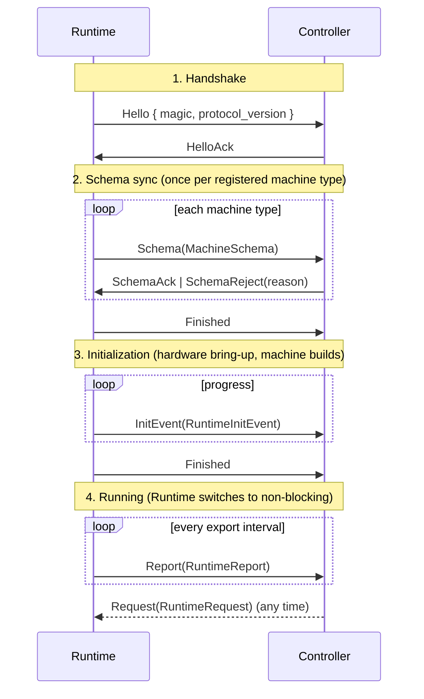

# Runtime ↔ Controller Protocol

The **Runtime** runs the machines. The **controller** is whatever sits on the other side of the connection: the TUI, the Hub, or your own implementation. It receives the Runtime's data and sends it requests. This document describes how the two talk to each other: the rules, the phases of a session, the messages, and the transports.

Code: `qitech_framework_core/src/session/` (protocol, handshake, transports), `qitech_framework_core/src/report/` (what the Runtime sends) and `qitech_framework_core/src/request.rs` (what the controller sends).

## Roles and rules

The Runtime's job is to control machines. Communication comes second and must never get in the way of machine execution. The controller does everything else: it receives, buffers, stores and distributes data, and it sends requests.

The protocol is built on these invariants:

1. **Exactly one controller session** exists at a time.
2. **Machine execution is never blocked by data delivery.**
3. **Reports are ordered and are never intentionally dropped.** A report stream is internally consistent, and missing reports are not tolerated.
4. **The controller is responsible for consuming and storing data.** The Runtime is not a broker or a database.
5. **If the session is lost, the Runtime terminates.** If the controller disconnects, or can't keep up with reports, the Runtime shuts down deterministically instead of buffering without limit, dropping reports, or carrying on without a controller.
6. **A new session needs a full resynchronization.** The Runtime never reconnects mid-run, because machine state could be missed in the meantime. A new session always starts from the beginning.

The reasoning: an incomplete or unverifiable history of machine state is worse than a clean stop.

## Session lifecycle

A session goes through four phases. Both sides encode them as **typestate**: each phase is its own Rust type, and moving to the next phase consumes the previous one, so it is impossible to send a message from the wrong phase.

| Phase | Runtime type (`session::runtime`) | Controller type (`session::controller`) |
|---|---|---|
| 1. Handshake | `SessionHandshake` | `SessionHandshake` |
| 2. Schema sync | `SessionSyncingSchemas` | `SessionSyncingSchemas` |
| 3. Initialization | `SessionInitializing` | `SessionInitializing` |
| 4. Running | `SessionRunning` | `SessionRunning` |



### 1. Handshake

The Runtime sends `Hello` with a magic number (`0x4855425F4C494E4B`, which is ASCII `HUB_LINK`) and `PROTOCOL_VERSION`. The controller replies `HelloAck`, or `HelloReject(HelloMatchError)` if the magic or version doesn't match.

Runtime API: `SessionHandshake::begin_sync()`. Controller API: `SessionHandshake::complete()`.

### 2. Schema sync

For every machine type registered in `RuntimeConfiguration`, the Runtime sends that type's parsed `MachineSchema` and **waits** for an answer:

- `SchemaAck`: the controller accepted the schema.
- `SchemaReject(SchemaSyncError)`: the reason is one of `DuplicateItem`, `UnsupportedQmsVersion`, `CannotResolveRevisionConflict` or `Custom(String)`. The session ends, and so does `Runtime::init`.

After the last schema, the Runtime sends `Finished`.

The controller now knows every machine *type* the Runtime can run, and therefore every resource path and type it may later see in reports. See [resources.md](resources.md).

Runtime API: `sync(schema)`, then `begin_initialization()`. Controller API: `sync(|schema| -> Result<(), SchemaSyncError>)`.

### 3. Initialization

The Runtime brings up hardware and builds machine instances, streaming progress as `InitEvent(RuntimeInitEvent)`. The controller doesn't reply in this phase. The events arrive roughly in this order:

1. **EtherCAT**: `EtherCATDiscoveryStarted`, `EtherCATDiscoveryCompleted { interface }`, `EtherCATInitializationStarted`, `EtherCATDeviceInitializationCompleted { devices }` or `…Failed { error }`, and `EtherCATStateUpdate(status)`.
2. **Modbus RTU**: `ModbusRTUDiscoveryStarted`, then `ModbusRTUDeviceNotFound { path }` or `ModbusRTUCouldNotInitialize { error }` for each device that fails.
3. **Xtrem**: `XtremDiscoveryStarted`, `XtremDiscoveryCompleted { modules }`, `XtremBusFailed`, `XtremDeviceNotFound`, `XtremDeviceIdCollision` and `XtremCouldNotInitialize`.
4. **Machines**: `BuildingMachines`, `MachineBuildStarted { ident }`.
5. **Finalizing**: `EtherCATFinalizing` and `EtherCATStateUpdate(status)` as the bus goes to Op.
6. `MachineBuildCompleted { ident, result }` for every machine instance. These are sent **after** the EtherCAT bus is confirmed operational, so "build succeeded" means the machine is actually ready to run.

A failed device or machine build is reported, but it does *not* end the session. The Runtime goes on to run with the machines that did build.

`RuntimeInitStatus::from(&event)` maps each event to a coarse phase such as `EtherCATDiscovery` or `BuildingMachines`, which is handy for progress indicators.

Finally the Runtime sends `Finished` again and switches its transport to **non-blocking**.

Runtime API: `send_event(event)`, then `upgrade()`. Controller API: `complete(|event| …)`.

### 4. Running

From now on, the Runtime's main loop owns the session:

- **Requests** (controller → Runtime): at the start of each cycle, the Runtime reads **up to `requests_per_cycle_max`** pending requests (10 by default) without blocking, and processes them in order.
- **Reports** (Runtime → controller): every `export_interval` (1/32 s by default), the Runtime sends one `Report(RuntimeReport)` with everything that happened since the previous report.

There is no separate response message. **Request results come back inside the next report**, as `RuntimeResponse { request_id, result }` entries.

Runtime API: `recv_request()` and `send_report(report)`. Controller API: `recv_report()` and `send_request(request)`.

## Messages

Defined in `session/protocol.rs`.

```rust
enum RuntimeMessage {            // Runtime → controller
    Hello(Hello),
    Schema(Box<MachineSchema>),
    InitEvent(RuntimeInitEvent),
    Finished,                    // ends phase 2 and phase 3
    Report(Box<RuntimeReport>),
}

enum ControllerMessage {         // controller → Runtime
    HelloAck,
    HelloReject(HelloMatchError),
    SchemaAck,
    SchemaReject(SchemaSyncError),
    Request(RuntimeRequest),
}
```

A message that isn't valid in the current phase ends the handshake with `HandshakeError::UnexpectedMessage`. In the running phase it gives `SessionRecvError::UnexpectedMessage`.

### Requests

```rust
struct RuntimeRequest { request_id: u64, kind: RuntimeRequestKind }
```

The **controller** chooses `request_id` and uses it to match the response later. It must be unique within the session. The Hub uses a counter that goes up by one per request.

| `RuntimeRequestKind` | Effect | Error type |
|---|---|---|
| `SetConfigProperty { target, path, value: ScalarValue }` | Writes a config property: checks type, write permission and constraints, then fires `on_external_changed`. | `MachineSetConfigProperty` |
| `ExecuteCommand { target, path }` | Runs a command if its `can_execute` currently allows it. | `MachineExecuteCommandError` |
| `SubscribeMachine { provider, subscriber }` | Calls `subscriber.subscribe(ctx)` so it can get handles to the provider's resources. | `MachineSubscribeError` |
| `UnsubscribeMachine { provider, subscriber }` | Ends the subscription and invalidates the subscriber's handles. | `MachineUnsubscribeError` |
| `WriteMachineDeviceInfo { machine_ident, role, subdevice_index }` | Writes the machine identity to an EtherCAT device's EEPROM. | `WriteMachineDeviceInfoError` |

A request that is accepted is *also* visible in the report's history. For example, a config write shows up both as the response `Ok(())` and as a `ConfigPropertyEvent::Written { origin: Request { request_id }, … }`. The origin links the history record back to the request.

### Reports

```rust
struct RuntimeReport {
    timestamp:  DateTime<Utc>,        // when the report was created
    responses:  Vec<RuntimeResponse>, // results of requests processed in this window
    timings:    TimingsReport,        // cycle count, total/peak duration, overruns
    machines:   MachinesReport,       // resource activity, see below
    events:     Vec<RuntimeEvent>,    // AddedMachine, RemovedMachine, SubscriptionAdded/Removed
    logs:       Vec<LogRecord>,
}
```

`MachinesReport` holds the resource history for this window:

- `config_property_records`: `EventRecord<ConfigPropertyEvent>`. One of `Registered`, `Written`, `DefaultChanged`, `CapabilityChanged` or `ConstraintsChanged`.
- `state_property_records`: `EventRecord<StatePropertyEvent>`. One of `Registered` or `ValueChanged`.
- `command_records`: `EventRecord<CommandEvent>`. One of `Registered`, `CapabilityChanged` or `Executed(Result<(), CommandExecuteError>)`.
- `event_records`: machine events that were emitted.
- `measurement_snapshots`: one sampled value per measurement, taken when the report is created.

Each `EventRecord` carries `timestamp`, `machine` (the instance), `path` (the resource path) and the `event` itself.

Reports are **deltas**. A controller rebuilds the current state by applying every report in order, starting from the first one, which contains the `Registered` records. That's why dropping a report isn't allowed: the controller's view would diverge silently.

## Wire format

In-process transports pass the Rust values directly. Byte-stream transports (Unix sockets) use `session::unix::Codec`:

```
┌──────────────────────┬──────────────────────────────┐
│ length: u32 (big-end)│ payload: postcard(message)   │
└──────────────────────┴──────────────────────────────┘
```

- The payload is the `RuntimeMessage` or `ControllerMessage` serialized with [postcard](https://docs.rs/postcard).
- postcard is **not self-describing**: enum variants are encoded by their position, and struct fields by their order. Reordering, inserting or removing a variant or field in *any* type that crosses the wire is a breaking change. When you make one, bump `PROTOCOL_VERSION` in `session/protocol.rs`.
- The largest possible frame is `u32::MAX` bytes.

## Transports

A transport carries messages. The phases above are the same whichever transport you use.

| Transport | Constructor | Use | Notes |
|---|---|---|---|
| **In-process channels** | `session::mpsc(capacity)` gives a `(runtime_provider, controller_provider)` pair | `run_with_tui` and `run_with_hub`, where the Runtime and controller share one process | tokio `mpsc` channels. Each provider can only provide one session; asking again gives `Disconnected`. |
| **Unix socket** | Runtime: `session::unix::runtime(path)`. Controller: `session::unix::controller_tokio(path)` | Runtime and controller in separate processes | The **Runtime is the server**: it removes any stale socket file, binds, and accepts exactly one connection. The controller connects. The Runtime side is synchronous (`std`), the controller side async (tokio). |
| **Debug** | `DebugRuntimeSessionProvider` | `run_debug`, i.e. no controller | Acknowledges everything automatically and prints messages to stdout. Requests are never received. |

To write your own transport, implement:

```rust
trait RuntimeTransport {                                // sync; used from the machine loop
    fn set_blocking(&mut self, blocking: bool) -> Result<(), TransportError>;
    fn recv(&mut self) -> Result<ControllerMessage, TransportError>; // non-blocking: Err(WouldBlock)
    fn send(&mut self, msg: RuntimeMessage) -> Result<(), TransportError>;
}

trait ControllerTransport: Send + Sync {                // async
    async fn recv(&mut self) -> Result<RuntimeMessage, TransportError>;
    async fn send(&mut self, msg: ControllerMessage) -> Result<(), TransportError>;
}
```

and a matching `RuntimeSessionProvider` / `ControllerSessionProvider` that returns a `SessionHandshake`.

In non-blocking mode, `RuntimeTransport::recv` must return `Err(TransportError::WouldBlock)` when nothing is waiting. `send` must never block the machine loop (invariant 2). If a report can't be accepted, return an error.

`TransportError` values: `Disconnected`, `Io`, `MalformedMessage`, `PeerSynchronizationLost` and `WouldBlock`.

## Writing a controller

The shortest correct controller loop, using the provided session types:

```rust
let session = provider.provide().await?;               // ControllerSessionProvider
let session = session.complete().await?;               // Hello → HelloAck
let session = session.sync(|schema| {                  // store schemas; Err(..) rejects
    schemas.insert(schema.identification, schema);
    Ok(())
}).await?;
let mut session = session.complete(|event| {           // show init progress
    println!("{event:?}");
}).await?;

loop {
    let report = session.recv_report().await?;        // apply in order, never skip
    // … match report.responses[*].request_id to pending requests …
    // … session.send_request(RuntimeRequest { request_id, kind }).await? …
}
```

Guidelines:

- **Read reports promptly.** If you can't keep up, the Runtime ends the session. Do slow work, such as database writes or UI rendering, off the receive path.
- **Keep your own schema registry per session.** A new session is a fresh Runtime, so reset what you learned from the previous one.
- **Correlate responses by `request_id`.** Several responses can arrive in one report.
- **Use the history records as the source of truth for resource values.** A response only tells you whether the request was accepted.
